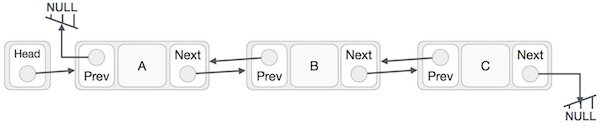
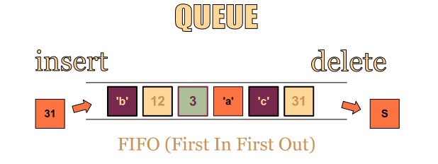
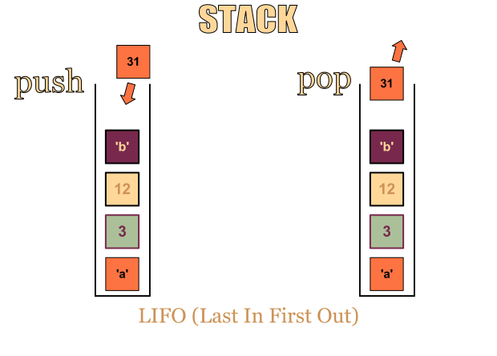
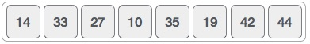
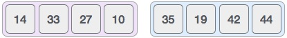
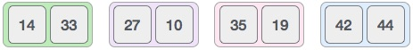
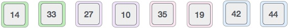

# algorithms-primer
A consolidated collection of resources for you to learn and understand algorithms and data structures easily. 

# Objectives
It is difficult to find consolidated resources on algorithms. 
This repo hopes to gather resources to help one understand algorithms better to prepare 
for technical tests or simply to strengthen your foundation of computer science to help you become a better coder.

# Contributions
Contributions are more than welcome. I cant do everything myself, so I will need all the help I can get. To 
- add a new section or to 
- add on to existing sections, 
- or translate
simply submit a pull request. 

If you are arent sure of how to create a pull request, view the [pull request documentation](https://help.github.com/articles/about-pull-requests/).

# Algorithms Topics
Summaries of the algorithms topics:
- [P versus NP](#p-versus-np)
- [Brute force method](#brute-force-method)
- [Divide and conquer algorithm](#divide-and-conquer-algorithm)
- [Dynamic Programming](#dynamic-programming)
	- [Memoization](#memoization)
	-	[Greedy Algorithms](#greedy-algorithms)
- [Knapsack problem](#knapsack-problem)
- [Djikstra](#djikstra)
- [Prim's Algorithm](#prim's-algorithm)
- [Data Structure](#data-structure)
	- [Linked Lists](#linked-lists)
	- [Arrays vs linked lists](#arrays-vs-linked-lists)
	- [Single Linked List](#single-linked-list)
	- [Doubly Linked List](#doubly-linked-list)
	- [Circular Linked List](#circular-linked-list)
	- [Operations on a Linked List](#operations-on-a-linked-list)
- [Queues](#queues)
- [Stacks](#stacks)
- [Asymptotic Notation](#asymptotic-notation)
	- [Big-O Notation](#big-o-notation)
	- [Big-Ω (Big-Omega) notation](#big-Ω-(big-omega)-notation)
	- [Big-θ (Big-Theta) notation](#big-θ-(big-theta)-notation)
- [Search](#search)
	- [Linear Search](#linear-search)
	- [Binary Search](#linear-search)
	- [Red Black Trees](#red-black-trees)
- [Sorting](#sorting)
	- [Bubble sort](#bubble-sort)
	- [Selection sort](#selection-sort)
	- [Insertion sort](#insertion-sort)
	- [Merge sort](#merge-sort)

## P versus NP
**What is P vs NP?**

P vs NP is a notorious problem in algorithms and in Computer Science.

**P** stands for **polynomial time** (Polynomial time means that the complexity of the algorithm is O(n^k), where n is the size of your data (e. g. number of elements in a list to be sorted), and k is a constant). 

**NP** stands for **non-deterministic polynomial time**.

**NP-complete** is a family of NP problems for which you know that if one of them had a polynomial solution then everyone of them has.

Problems can be divided into P problems, which are easily **solved** by computers, and NP problems are not easily solvable, but if you present a potential solution it’s easy to **verify** whether it’s correct or not.

**Is P=NP and why do I need to care?**

For the longest of time, people have been trying to prove that P=NP or otherwise. It is important that we pay attention to it because many NP problems are problems we want to solve, e.g. in circuit design or in other industrial design applications.

If it were proven that P = NP and the proof provided a specific polynomial time algorithm for an NP-complete problem, then because of the existing reduction proofs, we could immediately produce polynomial time algorithms for all our other NP problems.

**Read more here:**
- [Regarding RSA cryptography](https://www.quora.com/What-is-an-intuitive-explanation-of-P-NP)
- https://danielmiessler.com/study/pvsnp/#gs.null
- http://news.mit.edu/2009/explainer-pnp

## Brute force method
Brute force method (Generate & Test) is simplest way to explore the space of solutions - it simply means to go through all solutions, however unlikely they may be, something which is not particularly elegant.

## Divide and conquer algorithm
Divide and Conquer means to break down a problem into two or more sub-problems of the same or related type, until these become simple enough to be solved directly.

Examples:
- [Quick sort](#quick-sort)
- [Merge sort](#merge-sort)

## Dynamic Programming
**What is DP?**

DP or dynamic programming basically means to take our problem and somehow break it down into a reasonable number of subproblems so that we can use optimal solutions to the smaller subproblems to give us optimal solutions to the larger ones.

- Allows one to solve many different types of problems in time O(n)^2 or O(n)^3
- Usually focused on Principle of Optimality, "An optimal solution to any instance of an optimization problem is composed of optimal solutions to its subinstances"

**Read more:**
- [Competitive Programming book by Steven and Felix Halim](http://www.comp.nus.edu.sg/~stevenha/myteaching/competitive_programming/cp1.pdf)
- [Introduction to Dynamic Programming](http://www.techiedelight.com/introduction-dynamic-programming/)
- [Dynamic Programming – From Novice to Advanced](https://www.topcoder.com/community/data-science/data-science-tutorials/dynamic-programming-from-novice-to-advanced/)
- https://people.eecs.berkeley.edu/~vazirani/algorithms/chap6.pdf

**Courses**
- [MIT (Introduction to Algorithms (chapter 15))](https://ocw.mit.edu/courses/electrical-engineering-and-computer-science/6-046j-introduction-to-algorithms-sma-5503-fall-2005/video-lectures/lecture-15-dynamic-programming-longest-common-subsequence/)

**Practice here:**
- https://www.hackerrank.com/domains/algorithms/dynamic-programming

**Common interview questions:**
- 0/1 Knapsack Problem
- Coin change - Given a set of coins and amount, Write an algo­rithm to find out how many ways we can make the change of the amount using the coins given.
- Edit Distance - Given two strings and a set of operations Change (C), insert (I) and delete (D) , find minimum number of edits (operations) required to transform one string into another.
- Longest Common Subsequence

### Memoization
Memoization is an optimization technique used primarily to speed up computer programs by storing the results of expensive function calls and returning the cached result when the same inputs occur again. 

**Read more here:**
- http://www.geeksforgeeks.org/tabulation-vs-memoizatation/

### Greedy Algorithms 
In greedy algorithm approach, it builds up a solution piece by piece, where the next piece that offers the most obvious and immediate benefit is chosen.

Algorithms which use the greedy approach:
- Travelling Salesman Problem
- Prim's Minimal Spanning Tree Algorithm
- Kruskal's Minimal Spanning Tree Algorithm
- Dijkstra's Minimal Spanning Tree Alsgorithm
- Graph - Map Coloring
- Graph - Vertex Cover
- Knapsack Problem
- Job Scheduling Problem 

## Knapsack problem
Knapsack problem or the rucksack problem is part of dynamic programming and it is where given a set of items, each with a weight and a value, determine the number of each item to include in a collection so that the total weight is less than or equal to a given limit and the total value is as large as possible. 

**Read more here:**
- [Introduction to Knapsack](https://www.youtube.com/watch?v=8LusJS5-AGo)
- [0-1 Knapsack problem](http://cse.unl.edu/~goddard/Courses/CSCE310J/Lectures/Lecture8-DynamicProgramming.pdf)

**Practice here:**
- https://www.hackerrank.com/challenges/unbounded-knapsack
- http://practice.geeksforgeeks.org/problems/0-1-knapsack-problem/0

## Djikstra
TODO

## Prim's Algorithm
TODO

# Data Structure
## Linked Lists

[Introduction to linked lists/ Vectors vs. Linked List](https://www.youtube.com/watch?v=pBrz9HmjFOs) (13 minute video)

- Link − Each link of a linked list can store a data called an element.

- Next − Each link of a linked list contains a link to the next link called Next.

- LinkedList − A Linked List contains the connection link to the first link called First.



- Linked List contains a link element called first.

- Each link carries a data field(s) and a link field called next.

- Each link is linked with its next link using its next link.

- Last link carries a link as null to mark the end of the list.

### Arrays vs linked lists
The linked lists have pointers to the next and the previous item unlike arrays.

**Advs of Linked Lists**
- Dynamic size
- Less expensive to insert/delete
	In arrays, you will have to shifts the items each time an items is inserted/deleted. For linked lists, you just have to change the links to point to the items.

**Disadvs of Linked Lists** 
- We cannot perform a random access of items. We have to access elements sequentially starting from the first node (or at the last node if it is a doubly linked list). So we cannot do binary search with linked lists. In arrays, however, you can simply specify the index of the array to get to the item.
- Extra memory space for a pointer is required with each element of the list.
- Arrays have better cache locality that can make a pretty big difference in performance.

### Single Linked List 
Item navigation is forward only

### Doubly Linked List
Items can be navigated forward and backward

### Circular Linked List 
In a circular singly linked list, the last node of the list is made to point to the first node.

### Operations on a Linked List
- Insertion − Add a new data item in the given collection of data items
- Deletion − Delete an existing data item from the given collection of data items
- Traversal − Access each data item exactly once so that it can be processed
- Searching − Find out the location of the data item if it exists in the given collection of data items
- Sorting − Arranging the data items in some order i.e. in ascending or descending order in case of numerical data and in dictionary order in case of alphanumeric data

**Common interview questions**:

- Reverse a Linked List (recursive)
- Reverse a Linked List (iterative)
- Detect Loop in a Linked List
- Given pointers to two single-linked list, find out if they intersect and at which node they intersect
- Merge two unsorted linked list in efficient way
- Delete repeated elements from linked list

**Practice here**: 
- https://www.hackerrank.com/domains/data-structures/linked-lists
- http://www.geeksforgeeks.org/practice-questions-for-linked-list-and-recursion/

## Queues


source: [Stoimen](http://www.stoimen.com/blog/2012/06/05/computer-algorithms-stack-and-queue-data-structure/).

Queues is a data structure which follows a First-In-First-Out (FIFO) or Last-In-Last-Out (LILO) methodology. 
One end is always used to insert data (enqueue) and the other is used to remove data (dequeue).

### Applications of a queue
- Pipes
- File IO

**Practice here**: 

- https://www.hackerrank.com/domains/data-structures/queues

## Stacks


source: [Stoimen](http://www.stoimen.com/blog/2012/06/05/computer-algorithms-stack-and-queue-data-structure/).

Stacks is a data structure which follows a LIFO (last in, first out) methodology.	

To insert an item, it is called “Push”, to remove an item off is called “Pop”.

### Applications of a stack
- Infix to Postfix Conversion using Stack
- Evaluation of Postfix Expression
- Reverse a String using Stack
- Implement two stacks in an array
- Check for balanced parentheses in an expression

**Practice here**: 

- https://www.hackerrank.com/domains/data-structures/stacks

**Common interview questions for queues and stacks:**

- Which Data Structure Should be used for implementiong LRU cache? (Ans: Queue which is implemented using a doubly linked list)
- Queue Implemented with Two Stacks

### Heaps
TODO
### Tree Traversal
TODO
### Deque
TODO

# Asymptotic Notation
## Big-O Notation 
The Big O notation describes the complexity of an algorithm. 
It describes:
- The worst-case scenario, 
- the execution time required/space used
- the upper asymptotic bound

**O(1)**

Same time regardless of the size of the input data

Coding examples:
- Accessing Array Index (int a = array[0];)
- print "hello";


**O(N)**

Performance will grow linearly and in direct proportion to the size of the input data set.

Coding examples: 
- Traversing an array
- Traversing a linked list
- Linear Search

**O(N)^2**

Performance is directly proportional to the square of the size of the input data set.
This is common with nested iterations over the data set.

These ones are supposed to be the less efficient algorithms if their O(n log n) counterparts are present.

Coding examples: 
- Bubble Sort
- Insertion Sort
-	Selection Sort

**O(2N)**

Performance doubles with each additon to the input data set. The growth curve of an O(2N) function is exponential.

Coding examples: 
- Recursive calculation of Fibonacci numbers

**O(log n)**

O(log n) is slightly more difficult to explain. 
One good example of a O(log n) problem is when searching up a phone book. Even if the phone book is thick, you would not need to search every name, but you just have to look for the name under the correct alphabet. 

Reducing the problem size with every iteration

Coding examples:
- Binary search
- Finding largest/smallest number in a binary search tree

**O(n log n)**

To better understand it, think of it as O(N) and O(log n). An example of such a notation is the Quick sort when we divide the array into two parts and each time it takes O(N) time to find a pivot element. 

Coding examples:
- Merge Sort
- Heap Sort
- Quick Sort

## Big-Ω (Big-Omega) notation
It describes:
- The best-case scenario
- the lower asymptotic bound

An example of Big O vs Big Omega of a problem:
http://www.programmerinterview.com/index.php/data-structures/big-o-versus-big-omega-notations/


## Big-θ (Big-Theta) notation
- Both the lower and upper asymptotic bound (tight bound)

**Common interview questions**

- What are the expected runtimes of some common data structures? (e.g., Hash Table, Binary Search Tree, Array, etc)

# Search
## Linear Search/Sequential Search
- Linear Search/Sequential Search is used when a list of integers is not in any order
- Examines the first element in the list and then examines each "sequential" element in the list until a match is found
- Worst-case performance‎: ‎O(n)
- Best-case performance‎: ‎O(1)

**Read more here**

- https://www.tutorialspoint.com/data_structures_algorithms/linear_search_algorithm.htm

## Binary Search
- Used when in a sorted sequence
- Worst-case performance‎: ‎O(log n)
- Best-case performance‎: ‎O(1)

**How does it work?**

Assume we have an array of numbers which are arranged in sequence where we want to find out if the number, 17 is within the array. 

```
[2, 3, 5, 7, 11, 13, 17, 19, 23]
```

Based on linear search, we have to start at index 0 and progressively go through each element in the array. That would take us 7 searches before we arrive at 17. 
However, based on binary search, 

1. **Set the minIndex and maxIndex** - In this case, let minIndex = 0 and maxIndex = 8.

2. **Set the middle element as the first guess** - The first guess would be value 11, index 4 (since 8/4). Since the array is sorted, we know that if 17 exists, it would be on the right side of the array since 17>11. 

3. **Change the minIndex/maxIndex** - We shift the minIndex to be 5 and maxIndex stays the same at 8. 

4. **Make another guess based on the new minIndex/maxIndex** - Taking the average, our second guess would be at index (8+5)/2 = 6.5 ~ 6, with a value of 17. We have found our integer. 

**In conclusion:**

| Search        |            	|
| ------------- |:-----------:|
| Linear 				| 7 					|
| Binary 				| 2      			|

**Practice here:** 
- https://www.hackerrank.com/challenges/binary-search-tree-insertion

**Read more here**
- http://www.geeksforgeeks.org/binary-search/

**Common interview questions:**
- How to verify whether a binary tree is a binary search tree? ([Answer](http://www.ardendertat.com/2011/10/10/programming-interview-questions-7-binary-search-tree-check/))
- Find Minimum Depth of a Binary Tree
- Maximum Path Sum in a Binary Tree
- Check if a given array can represent Preorder Traversal of Binary Search Tree

## Red Black Trees
A red-black tree is a binary search tree.

Its properties: 
- Every node is either red or black
- Every leaf (root of tree) (NULL) is black. 
- If a node is red, then both its children are black
- Every simple path from a node to a descendant leaf contains the same number of black nodes

**Courses**
- http://ocw.mit.edu/courses/electrical-engineering-and-computer-science/6-046j-introduction-to-algorithms-sma-5503-fall-2005/video-lectures/lecture-10-red-black-trees-rotations-insertions-deletions/

## Naïve Divide and Conquer
TODO
## Breadth first search
TODO

# Sorting
## Bubble sort
This sorting algorithm is where each item is compared to adjacent items and is exchanged with those that are out of order. Simply put, each item “bubbles” up to the location where it belongs

- Best-case performance‎: ‎O(N)^2
- Worst-case performance‎: ‎O(N)^2

Bubble sort in C : 
- https://www.tutorialspoint.com/data_structures_algorithms/bubble_sort_program_in_c.htm

## Selection sort
This sorting algorithm is where a list of numbers is divided into two parts, the sorted part at the left end and the unsorted part at the right end. Initially, the list is unsorted. 

1. **Select and swap** - Select the smallest element from the unsorted part and swapped with the leftmost element
2. **Continue the process** - This process continues until eventually the whole list becomes sorted

- Best-case performance‎: ‎O(N)^2
- Worst-case performance‎: ‎O(N)^2

**Read more here:**

- https://www.tutorialspoint.com/data_structures_algorithms/selection_sort_algorithm.htm


## Quick sort
A sorting algorithm which uses divide-and-conquer. 

**How it works?**

1. **Pick a pivot** - Given an unsorted list of numbers, pick an element in the list as a pivot

2. **Partitioning** - Rearrange the elements so that all other elements in the list that are less than or equal to the pivot are to its left and all elements in the list are to the pivot's right

3. **Recursively sort** - Recursively sort the elements to the left of the pivot, which must be less than or equal to the pivot) and the elements to the right of the pivot, which must be greater than the pivot

- Best-case performance‎: ‎O(n log n)
- Worst-case performance‎: ‎O(n)^2

**Read more here**
- https://www.tutorialspoint.com/data_structures_algorithms/quick_sort_algorithm.htm

**Practice here:** 
- https://www.hackerrank.com/challenges/quicksort1
- https://www.hackerrank.com/challenges/quicksort2
- https://www.hackerrank.com/challenges/quicksort3

## Merge sort

**How it works?**

1. Continuously split the whole list into equal halves until atomic values are achieved and it can no longer be divided. If the list is empty or has one item, it is sorted by definition (the base case).

2. Merge the smaller lists into a new list in sorted order









Source: [Tutorialspoint](https://www.tutorialspoint.com/data_structures_algorithms/merge_sort_algorithm.htm)

- Best-case performance‎: ‎O(n log n)
- Worst-case performance‎: ‎O(n log n)

**Practice here**
- [Quiz for sorting](http://quiz.geeksforgeeks.org/quiz-quicksort/)

# Recursion
TODO
# Graph Representation
TODO
# Travelling Salesman Problem
TODO

# Credits
I myself have learnt a lot while compiling these resources. Thanks to:
- [Hackerrank](https://www.hackerrank.com) 
- https://www.cs.cmu.edu/~avrim/451f09/lectures/lect1001.pdf
- Introduction to the Design & Analysis of Algorithms
- Quora
- Wikipedia
- http://algorithms.tutorialhorizon.com/dynamic-programming-coin-change-problem/
- https://www.tutorialspoint.com
- https://www.youtube.com/watch?v=pBrz9HmjFOs
- http://www.geeksforgeeks.org/linked-list-vs-array/
- https://rob-bell.net/2009/06/a-beginners-guide-to-big-o-notation/
- https://danielmiessler.com
- https://www.khanacademy.org
- http://interactivepython.org/
- https://math.stackexchange.com

Inspired by:
https://github.com/donnemartin/system-design-primer#step-1-review-the-scalability-video-lecture

# Contact
I would really like to learn from you, so contact me for any issues or questions or ideas.
My github page is [here](https://github.com/stacygohyunsi) and my email is hello@imstacy.com

# License
```
Creative Commons Attribution 4.0 International License (CC BY 4.0)

http://creativecommons.org/licenses/by/4.0/
```


